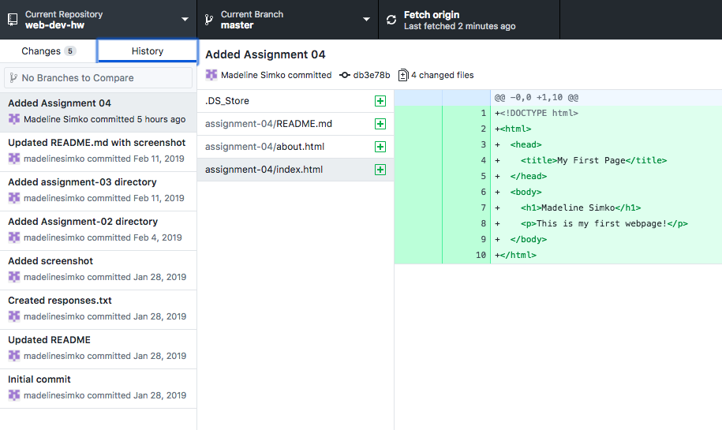

### The Wayback Machine
I used The Way Back Machine to look at the University of Montana's website from May 10, 2000. The website is very crude, with few visuals. Overall, it is not very attractive. It is crazy to think how far web design has come.

### GIT Module
I had never used the GIT module before this course. Overall, I do not find it super intuitive. When I make mistakes or accidentally do something out of order it does not feel very easy to correct myself.

### GitHub Desktop App

